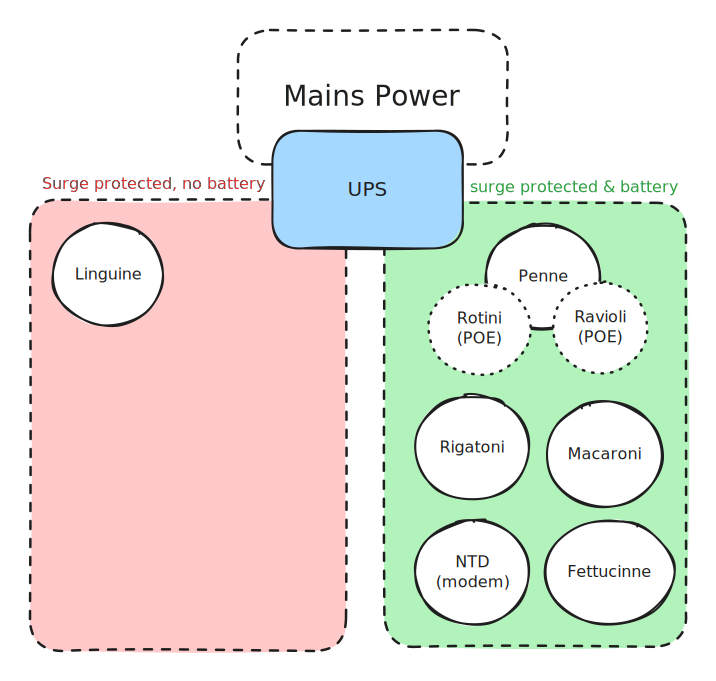

# ❔ CyberPower PowerPanel & UPS

[Link to App](https://ups.xfgn.dev/)

[Link to GitHub or Website](https://www.cyberpowersystems.com/product/software/power-panel-business/powerpanel-business-windows/)

## PowerPanel Server

PowerPanel® Business software features the most intuitive power management dashboard design on the market. Users can easily monitor and manage CyberPower UPS systems and network-connected PDUs at anytime from anywhere. The user-friendly dashboard provides real-time status at a glance and instant recognition of problems.

This app is hosted on Macaroni as a docker container, accessible at [https://10.0.0.2:3052](https://10.0.0.2:3052)&#x20;

The CyberPower UPS is plugged directly into Macaroni via USB.


```yaml
version: "3"

services:
  app:
    image: ghcr.io/nathanvaughn/powerpanel-business:both-490
    privileged: true
    network_mode: host
    ports:
      # Ports: ???, http, https, ???, snmp, snmp
      # See https://dl4jz3rbrsfum.cloudfront.net/documents/CyberPower_UM_PowerPanel-Business-486.pdf
      - 2003:2003
      - 3052:3052/tcp
      - 3052:3052/udp
      - 53568:53568/tcp
      - 53566:53566/udp
      #- 161:161/udp
      #- 162:162/udp
    devices:
      # sharing /dev/usb is sufficient for debian and ubuntu,
      # but other distributions might also need access to
      # /dev/bus/usb/*
      - /dev/usb:/dev/usb
      - /dev/bus/usb:/dev/bus/usb
    restart: unless-stopped
    volumes:
      - app_data:/data
      - /etc/TZ:/etc/TZ:ro

volumes:
  app_data:
    driver: local
```


| Port  | Purpose                      |
| ----- | ---------------------------- |
| 2003  | Unknown                      |
| 3052  | HTTP & panel communication   |
| 53568 | HTTPS & panel communication  |

| Host Volume                | Container Volume | Purpose                  |
| -------------------------- | ---------------- | ------------------------ |
| cyberpowerpanel\_app\_data | /data            | Storing data and configs |

## PowerPanel Remote

[Link to App (Fettuccine)](https://fettuccine.agg.local:3052)

PowerPanel Remote is a different version of PowerPanel that is intended for communicating with a server instance for monitoring a UPS


```yaml
version: "3"

services:
  app:
    image: ghcr.io/nathanvaughn/powerpanel-business:remote-490
    privileged: true
    network_mode: host
    ports:
      # Ports: ???, http, https, ???, snmp, snmp
      # See https://dl4jz3rbrsfum.cloudfront.net/documents/CyberPower_UM_PowerPanel-Business-486.pdf
      - 2003:2003
      - 3052:3052
      - 53568:53568/tcp
      - 53566:53566/udp
      #- 161:161/udp
      #- 162:162/udp
    restart: unless-stopped
    volumes:
      - data:/data
      - /etc/localtime:/etc/localtime:ro

volumes:
  data:
    driver: local
```


## UPS Hardware

The UPS is a CyberPower Value2200E and powers the NBN NTD, Fettuccine, Macaroni, Rigatoni, Penne and Rotini and Ravioli (PoE via Penne)

### Flowchart



### Images
